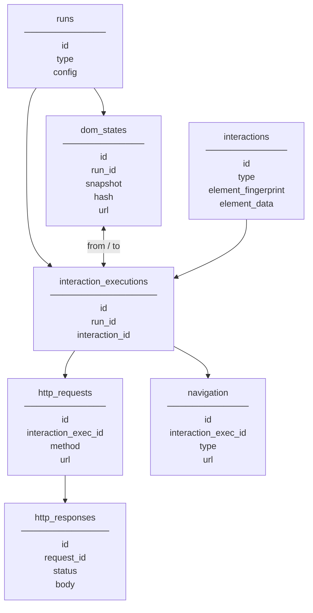

# Database Design

## Overview

The database stores the results of exploration runs, the logical interactions discovered during exploration, the concrete executions of those interactions, and the HTTP/DOM observations associated with each execution.

## Schema

